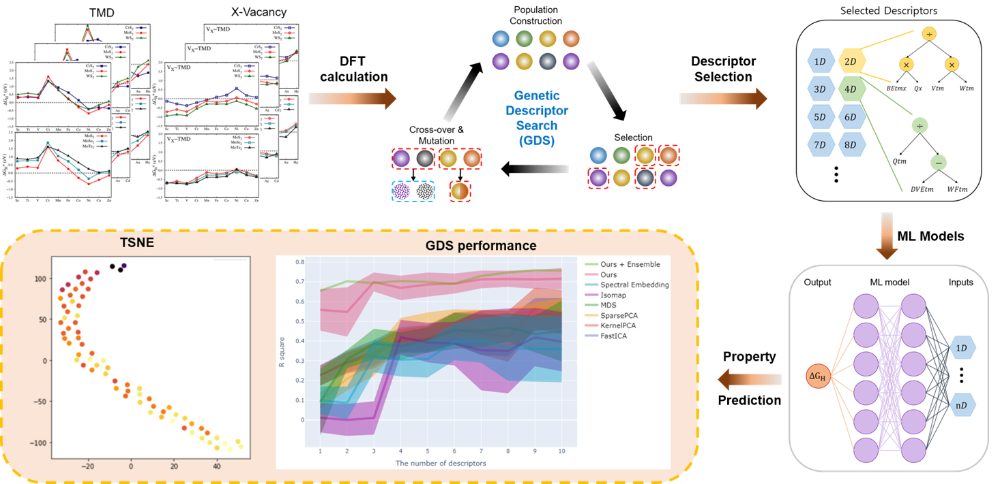
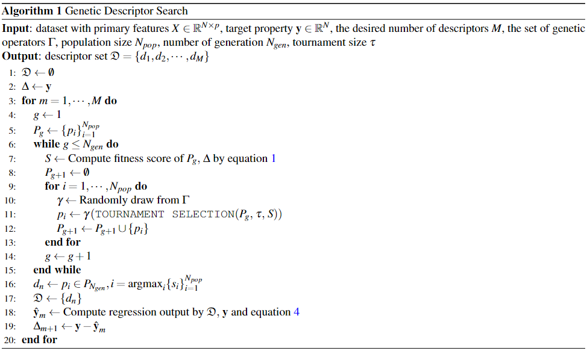
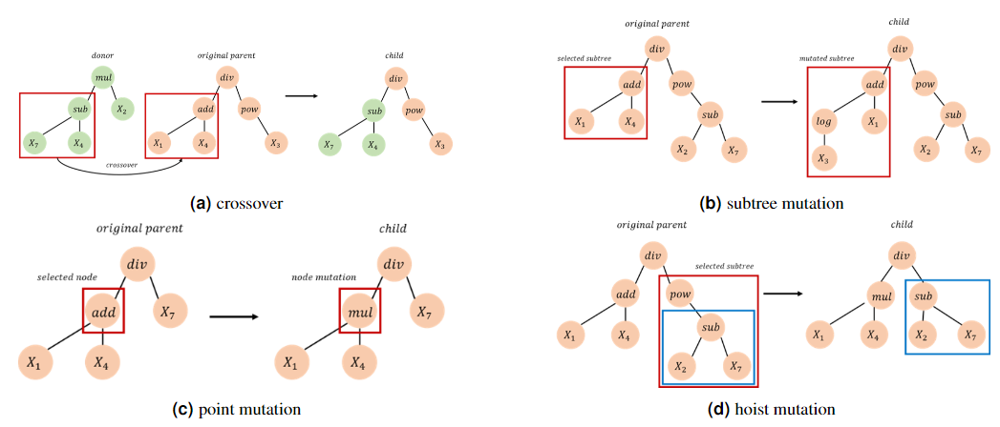
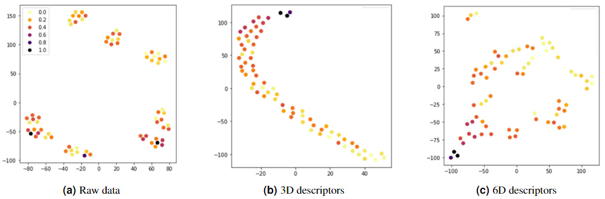

# BRL_project2_GDS

- Organization : Basic Research Laboratory, Ministry of Science and ICT
- Topic : "Descriptor search algorithm for material property prediction"
- Duration : 2021.09 ~ 2022.09
- Content : Predicting material properties using density function theory (DFT) involves significant time and computational resources. Therefore, we aim to replace these approaches with machine learning techniques, specifically employing a descriptor search algorithm Furthermore, we intend to utilize genetic algorithms to efficiently search for global optima.

## Genetic descriptor search algorithm for predicting hydrogen adsorption free energy of 2D material
- Scientific Reports [In-preparation]
- First author

 

### Full framework for Predicting Catalytic Suitability $\Delta G_H$, using 2D-TMD (Transition Metal Dichalcogenides) dataset

    

### Pseudocode for the Full Algorithm

    

### Genetic Operators

    

### Qualitative Confirmation of Descriptor Performance

    

### Hyperplanes using 2D descriptors

